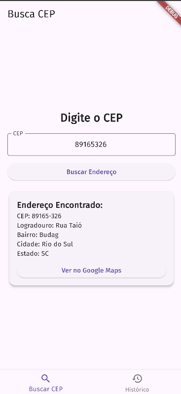

# Busca CEP - Aplicativo Flutter

> Este aplicativo permite que o usuário busque o endereço a partir de um CEP informado, exibindo o endereço completo, e salva as buscas realizadas em um histórico local.

## 🎯 Objetivo

O objetivo deste projeto é proporcionar uma interface simples e eficiente para buscar endereços através do serviço de API pública ViaCEP. O aplicativo conta com duas telas principais: uma para a busca de CEPs e outra para o histórico de buscas.

## 🤳🏻Funcionalidades

- **Tela de Busca de CEP**: Permite que o usuário insira um CEP e visualize o endereço correspondente.
- **Histórico de Buscas**: Armazena os endereços consultados e os exibe em uma lista.
- **Armazenamento Local**: Utiliza o `SharedPreferences` para salvar o histórico de buscas.
- **Integração com a API ViaCEP**: Realiza a consulta de endereços utilizando a API pública ViaCEP.

## 💻 Recursos Utilizados

- **Widgets Flutter**: Utilização de `Text`, `ElevatedButton`, `ListView.builder`, `Container`, `Column`, `Card`, entre outros.
- **SharedPreferences**: Para armazenar o histórico de buscas localmente.
- **API ViaCEP**: Para buscar o endereço a partir do CEP informado.
- **Google Maps**: Link para abrir o endereço encontrado no Google Maps.

## Como Baixar e Executar

### Requisitos

- **Flutter**: Certifique-se de ter o Flutter instalado. Para instalar, siga a [documentação oficial do Flutter](https://flutter.dev/docs/get-started/install).
- **Android Studio** ou **VS Code**: Um dos IDEs recomendados para desenvolver e executar o aplicativo.

### Passos para Executar

1. **Clone o Repositório**
   ```bash
   git clone https://github.com/seu_usuario/busca_cep.git

2. **Instale as dependências do projeto Dentro do diretório do projeto, execute:**
   ```bash
   flutter pub get

3. **Execute o Aplicativo Conecte um dispositivo físico ou inicie um emulador, depois execute:**
   ```bash
   flutter run

4. **Explore as Telas**
  - Tela de Busca de CEP: Insira um CEP válido para buscar o endereço correspondente.
  - Tela de Histórico: Veja os endereços previamente buscados.

## Imagem da Tela Inicial

## Imagem da Busca realizada

## Imagem do Histórico

